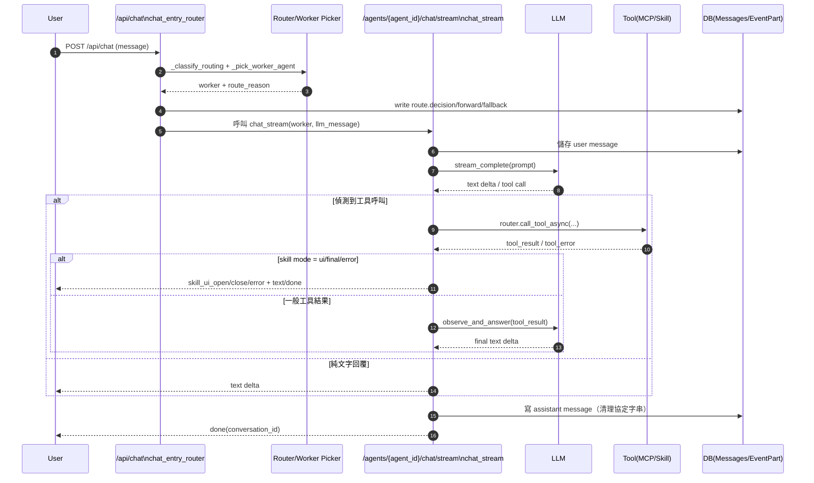

# Chat 執行流程（現況）

本文描述目前 `POST /api/chat` 的實際執行路徑（非 `ChatRouter.single_turn`）。

## 1) 入口總覽

- 入口：`backend/src/api/routes/chat.py` 的 `chat_entry_router`（`POST /chat`）
- 核心責任：
  - 驗證權限與輸入
  - 決定單代理或多代理
  - 寫入 route 事件
  - 轉發到 `chat_stream`（單代理）或 `_multi_agent_orchestrator`（多代理）

## 2) 前置處理

1. 權限檢查：`_require_chat_permission`
2. 讀取訊息：`payload.message`
3. 參考連結注入：`_inject_reference_content`
4. 取得主代理（`is_router=true`，否則退到第一個 enabled 代理）

## 3) 路由判斷（single / multi）

- 先找候選 worker：`agent_class in ['tasked','public']`
- 用 `_classify_routing` 判斷：
  - `multi`：進多代理 orchestrator
  - `single`：走單代理挑選 `_pick_worker_agent`

## 4) Multi 路徑（`_multi_agent_orchestrator`）

1. 發 `orchestrator.thinking`
2. 嘗試分解任務：`_decompose_tasks`
3. 若成功且任務數 >= 2：
   - 建立 `MultiAgentSession`
   - 建立 `MultiAgentTask`
   - 發 `orchestrator.plan`
   - 依波次執行 `_run_subtask_stream`
   - 合成與自評：`_synthesize_and_evaluate`
   - 發最終 `agent.text`（`task_index=-1`）與 `orchestrator.done`
   - 寫回 assistant message（sanitize 後）
4. 若分解失敗或不足 2 任務：降級為單代理路徑（仍會送 `route.decision`）

## 5) Single 路徑（`chat_stream`）

1. `_pick_worker_agent` 挑目標代理與 `route_reason`
2. readiness gate：`_is_agent_ready_for_chat`（不就緒則 fallback 主代理）
3. 建立/取得 conversation
4. 寫 route 事件：
   - `route.decision`
   - `route.forward`
   - （必要時）`route.fallback`
5. 若 `route_reason` 是 `*_skill_hint_*`，會在送給 LLM 的訊息前注入：
   - `[系統提示：請優先呼叫技能 ...]`
6. 呼叫 `chat_stream` 串流回覆

## 6) `chat_stream` 內部流程（ReAct + Tool）

1. 驗證 agent、訊息、conversation
2. 儲存 user message（可用 `persist_message` 避免把系統提示寫入 DB）
3. 初始化 router/LLM 與 agent integrations
4. 組 prompt：
   - `_build_recent_history_context`
   - `_build_capability_prompt`
5. 進入 `_gen` 串流迴圈：
   - 讀 LLM delta（`_stream_complete_async`）
   - 偵測工具呼叫（`[[CALL ...]]` 或 OpenAI `tool_calls` JSON）
   - 呼叫 `router.call_tool_async(...)`
   - 依結果走：
     - `skill_ui_open` / `skill_ui_close` / `skill_ui_error`
     - 或 `observe_and_answer`（工具結果回注 LLM 產最終答案）
   - 失敗則 `_fallback_general_answer`
6. `_gen_hb` 包裝心跳與逾時控制，最後合併 assistant chunks、清理協定字串並寫入 DB

## 7) 事件與可觀測性

### SSE 事件（前端即時）

- `route.decision`
- `text`, `done`, `heartbeat`
- `tool_start`, `tool`
- `react`（plan/act/result/reroute/finish）
- `skill_ui_open/close/error`
- `orchestrator.*`（multi 路徑）

### DB 事件（可查詢）

- `EventPart`：`/conversations/{id}/events`、`/routing-events`
- 路由事件在 `chat_entry_router` 直接落盤（`_write_event_part_safe`）

## 8) 與 `ChatRouter.single_turn` 的關係

- 目前一般聊天**不走** `single_turn`
- `single_turn` 主要用在：
  - `POST /agents/{agent_id}/llm-test`
  - 測試碼（integration tests）

## 9) 精簡時序圖

```text
Client
  -> POST /api/chat
    -> chat_entry_router
      -> classify routing
      -> [multi] orchestrator -> subtask streams -> synthesize -> done
      -> [single] pick worker -> write route events -> chat_stream
            -> llm stream
            -> (optional) tool call(s)
            -> observe/fallback
            -> persist assistant message
            -> SSE done
```

## 10) 程式碼行號索引

- 入口與路由
  - `POST /chat` 入口：`backend/src/api/routes/chat.py:2784`
  - 單/多代理分類：`backend/src/api/routes/chat.py:2808`
  - 多代理主流程：`backend/src/api/routes/chat.py:2542`

- 單代理挑選與 route 事件
  - worker 挑選：`backend/src/api/routes/chat.py:768`
  - humanizer 特例：`backend/src/api/routes/chat.py:837`
  - 技能意圖偵測：`backend/src/api/routes/chat.py:850`
  - 路由事件寫入：`backend/src/api/routes/chat.py:2901`
  - 技能 hint 注入訊息：`backend/src/api/routes/chat.py:2930`

- `chat_stream` 主流程
  - `GET /agents/{agent_id}/chat/stream`：`backend/src/api/routes/chat.py:1442`
  - 建立 `ChatRouter`：`backend/src/api/routes/chat.py:1486`
  - 能力提示組裝：`backend/src/api/routes/chat.py:1507`
  - 串流生成器 `_gen`：`backend/src/api/routes/chat.py:1559`
  - 心跳包裝 `_gen_hb`：`backend/src/api/routes/chat.py:2124`

- 工具呼叫與技能模式
  - 工具 API（單次）：`backend/src/api/routes/chat.py:1200`
  - 工具 API（串流）：`backend/src/api/routes/chat.py:1268`
  - ReAct 內工具呼叫：`backend/src/api/routes/chat.py:1970`
  - 技能模式處理（ui/final/error）：`backend/src/api/routes/chat.py:1693`
  - final 模式輸出 assistant message：`backend/src/api/routes/chat.py:1738`

- 多代理協作細節
  - 子任務串流執行：`backend/src/api/routes/chat.py:2355`
  - 合成與自評：`backend/src/api/routes/chat.py:2453`
  - `orchestrator.plan` 事件：`backend/src/api/routes/chat.py:2627`
  - `orchestrator.done` 事件（成功）：`backend/src/api/routes/chat.py:2737`

- 事件查詢 API
  - conversation events：`backend/src/api/routes/chat.py:3032`
  - routing events：`backend/src/api/routes/chat.py:3062`

- `ChatRouter.single_turn` 非主路徑佐證
  - 定義位置：`backend/src/services/chat_router.py:158`
  - 實際使用（LLM 測試 API）：`backend/src/api/routes/agents.py:996`

## 11) 依實際執行先後排序（請求到完成）

- `1.` 進入統一入口：`chat_entry_router`（`backend/src/api/routes/chat.py:2784`）
- `2.` 輸入檢查與參考內容注入：`_inject_reference_content`（`backend/src/api/routes/chat.py:2791`、`backend/src/api/routes/chat.py:2794`）
- `3.` 取得 router agent 與候選 worker，判斷 single/multi：`_classify_routing`（`backend/src/api/routes/chat.py:2796`、`backend/src/api/routes/chat.py:2808`）
- `4A.` 若 `multi`：進 `_multi_agent_orchestrator`（`backend/src/api/routes/chat.py:2542`）
- `4B.` 若 `single`：挑選 worker `_pick_worker_agent`（`backend/src/api/routes/chat.py:768`）
- `5B.` 單代理路徑寫入路由事件：`route.decision/forward/fallback`（`backend/src/api/routes/chat.py:2901`）
- `6B.` 若命中 skill hint，將技能提示注入給下游 LLM（`backend/src/api/routes/chat.py:2930`）
- `7B.` 轉入 `chat_stream` 執行串流回覆（`backend/src/api/routes/chat.py:2941`、`backend/src/api/routes/chat.py:1442`）
- `8B.` `chat_stream` 內初始化 LLM、整合能力與歷史上下文（`backend/src/api/routes/chat.py:1486`、`backend/src/api/routes/chat.py:1495`、`backend/src/api/routes/chat.py:1507`）
- `9B.` 進入 `_gen`：讀取 LLM delta、偵測工具呼叫、執行 `router.call_tool_async(...)`（`backend/src/api/routes/chat.py:1559`、`backend/src/api/routes/chat.py:1970`）
- `10B.` 若為技能互動結果，統一經 `_handle_skill_mode_result` 處理 `ui/final/error`（`backend/src/api/routes/chat.py:1693`）
- `11B.` `_gen_hb` 包裝心跳、逾時與 done 事件（`backend/src/api/routes/chat.py:2124`）
- `12B.` 回合收尾：合併文字、清理協定字串、寫入 assistant message（`backend/src/api/routes/chat.py:2204`、`backend/src/api/routes/chat.py:2210`）
- `13.` 前端可透過 events API 查回放資料（`backend/src/api/routes/chat.py:3032`、`backend/src/api/routes/chat.py:3062`）

### Multi 分支補充（4A 之後）

- 建立 session/task：`MultiAgentSession`、`MultiAgentTask`（`backend/src/api/routes/chat.py:2565`、`backend/src/api/routes/chat.py:2608`）
- 發計畫事件：`orchestrator.plan`（`backend/src/api/routes/chat.py:2627`）
- 執行子任務：`_run_subtask_stream`（`backend/src/api/routes/chat.py:2666`）
- 合成與自評：`_synthesize_and_evaluate`（`backend/src/api/routes/chat.py:2697`）
- 成功完成：`orchestrator.done` 並寫回 assistant message（`backend/src/api/routes/chat.py:2737`）

## 12) 單代理精簡序列圖（Mermaid）



