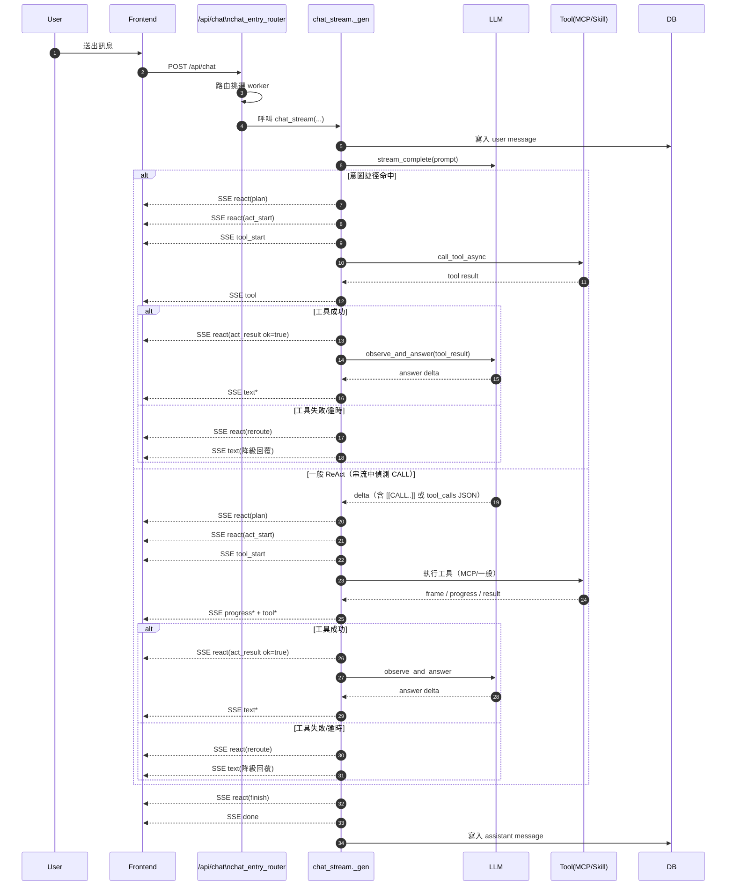

# ReAct 執行流程（含 SSE 事件與行號對照）

本文聚焦於 `backend/src/api/routes/chat.py` 的 ReAct 實際執行路徑，說明「起始點、執行過程、結束條件」，並附上時序圖。

## 1. ReAct 的實際起始點

- 對外統一入口是 `POST /api/chat`：`chat_entry_router`（`backend/src/api/routes/chat.py:3461`）。
- `chat_entry_router` 完成 worker 路由後，會呼叫 `chat_stream(...)`（`backend/src/api/routes/chat.py:3696`）。
- ReAct 主流程不在獨立 class，而在 `chat_stream` 內部的 `_gen()`：`backend/src/api/routes/chat.py:2041`。
- ReAct 狀態初始化：`react_step = 0`、`max_steps = REACT_MAX_STEPS`（`backend/src/api/routes/chat.py:2047`）。

## 2. ReAct 主流程分段（對照行號）

### 2.1 前置：進入 `chat_stream`

- API 入口：`@router.get('/agents/{agent_id}/chat/stream')`（`backend/src/api/routes/chat.py:1874`）。
- 檢查 agent / conversation / message、初始化 `ChatRouter`（`backend/src/api/routes/chat.py:1892`、`backend/src/api/routes/chat.py:1960`）。
- 組合 prompt（能力 + 歷史）：`_build_capability_prompt(...)`（`backend/src/api/routes/chat.py:1984`）。

### 2.2 ReAct 事件發送器與 Observe

- ReAct 事件封裝：`_react_event(phase, message, extra)`（`backend/src/api/routes/chat.py:2094`）。
- 工具失敗降級回答：`_fallback_general_answer(...)`（`backend/src/api/routes/chat.py:2100`）。
- Observe 階段（工具結果回注 LLM）：`_observe_and_answer(...)`（`backend/src/api/routes/chat.py:2146`）。

### 2.3 意圖捷徑（ReAct 之前的快捷 Act）

- 技能意圖推斷：`_infer_intent_skill_tool()`（`backend/src/api/routes/chat.py:2291`）。
- 若命中捷徑：先把 `react_step = 1`（`backend/src/api/routes/chat.py:2408`）。
- 立刻送出：
  - `react(plan)`（`backend/src/api/routes/chat.py:2434`）
  - `react(act_start)`（`backend/src/api/routes/chat.py:2440`）
  - `tool_start`（`backend/src/api/routes/chat.py:2445`）
- 執行工具：`router.call_tool_async(...)`（`backend/src/api/routes/chat.py:2448`）。
- 成功後進 Observe：`_observe_and_answer(...)`（`backend/src/api/routes/chat.py:2482`）。

### 2.4 一般 ReAct 迴圈（LLM 串流中偵測 Tool Call）

- 主串流迴圈：`async for delta in _stream_complete_async(...)`（`backend/src/api/routes/chat.py:2497`）。
- 解析工具呼叫：
  - `[[CALL tool=...]]`：`_parse_tool_call_block(...)`（`backend/src/api/routes/chat.py:1435`、`backend/src/api/routes/chat.py:2506`）
  - OpenAI `tool_calls` JSON：`_parse_openai_tool_call_block(...)`（`backend/src/api/routes/chat.py:1403`、`backend/src/api/routes/chat.py:2509`）
- 偵測到工具後：
  - `react_step += 1`（`backend/src/api/routes/chat.py:2520`）
  - 超過上限即終止（`backend/src/api/routes/chat.py:2521`）
  - `react(plan)`（`backend/src/api/routes/chat.py:2528`）
  - `react(act_start)`（`backend/src/api/routes/chat.py:2539`）
  - `tool_start`（`backend/src/api/routes/chat.py:2545`）

### 2.5 Act：工具執行分支

- MCP stdio 分支（串流）：`backend/src/api/routes/chat.py:2560`
  - 進度 `progress` 事件：`backend/src/api/routes/chat.py:2580`
  - 成功 `react(act_result)` + Observe：`backend/src/api/routes/chat.py:2604`、`backend/src/api/routes/chat.py:2606`
  - 失敗 `react(reroute)` + fallback：`backend/src/api/routes/chat.py:2595`
  - 逾時 `react(reroute)` + fallback：`backend/src/api/routes/chat.py:2616`
- MCP websocket 分支（串流）：`backend/src/api/routes/chat.py:2645`
  - 成功 `react(act_result)` + Observe：`backend/src/api/routes/chat.py:2690`、`backend/src/api/routes/chat.py:2692`
  - 失敗/逾時 reroute：`backend/src/api/routes/chat.py:2681`、`backend/src/api/routes/chat.py:2702`
- 非 MCP 工具分支：`router.call_tool_async(...)`（`backend/src/api/routes/chat.py:2754`）
  - 成功 `react(act_result)` + Observe：`backend/src/api/routes/chat.py:2766`、`backend/src/api/routes/chat.py:2781`

### 2.6 技能 UI 模式（UI/FINAL/ERROR）

- 統一處理函式：`_handle_skill_mode_result(...)`（`backend/src/api/routes/chat.py:2194`）。
- `mode=ui`：送 `skill_ui_open` + `done`（`backend/src/api/routes/chat.py:2216`、`backend/src/api/routes/chat.py:2237`）。
- `mode=final`：送 `skill_ui_close` + 文字 + `done`（`backend/src/api/routes/chat.py:2240`、`backend/src/api/routes/chat.py:2263`）。
- `mode=error`：送 `skill_ui_error` + fallback + `done`（`backend/src/api/routes/chat.py:2266`、`backend/src/api/routes/chat.py:2286`）。

### 2.7 收尾與心跳

- 若有未完成工具呼叫殘片，先 `text_clear_tool` 再 fallback（`backend/src/api/routes/chat.py:2792`）。
- ReAct 回合完成事件：`react(finish)`（`backend/src/api/routes/chat.py:2798`）。
- 最終 `done`：`backend/src/api/routes/chat.py:2799`。
- 心跳包裝 `_gen_hb()`：`backend/src/api/routes/chat.py:2802`（定期 `heartbeat`、收集文字、最終落盤）。

## 3. SSE 事件清單（ReAct 相關）

### 3.1 核心 ReAct 事件

- `type=react`
  - `phase=plan`
  - `phase=act_start`
  - `phase=act_result`
  - `phase=reroute`
  - `phase=finish`

### 3.2 搭配事件

- `type=tool_start`：開始呼叫工具。
- `type=tool`：工具 frame（成功/失敗/中間結果）。
- `type=progress`：工具進度（MCP 串流）。
- `type=text_clear_tool`：前端清掉協定殘字。
- `type=text`：實際回答文字增量。
- `type=heartbeat`：避免長串流中斷。
- `type=done`：本輪結束。
- `type=skill_ui_open|skill_ui_close|skill_ui_error`：技能互動模式。

## 4. ReAct 時序圖（含 SSE 事件）

## 5. 主要程式碼索引（快速定位）

- `/api/chat` 入口：`backend/src/api/routes/chat.py:3461`
- `chat_stream`：`backend/src/api/routes/chat.py:1874`
- ReAct `_gen`：`backend/src/api/routes/chat.py:2041`
- `react_step/max_steps`：`backend/src/api/routes/chat.py:2047`
- ReAct 事件封裝：`backend/src/api/routes/chat.py:2094`
- Observe：`backend/src/api/routes/chat.py:2146`
- 技能模式處理：`backend/src/api/routes/chat.py:2194`
- 意圖捷徑起點：`backend/src/api/routes/chat.py:2406`
- LLM 串流偵測 CALL：`backend/src/api/routes/chat.py:2497`
- `[[CALL]]` 解析：`backend/src/api/routes/chat.py:1435`
- `tool_calls JSON` 解析：`backend/src/api/routes/chat.py:1403`
- ReAct 收尾 `finish/done`：`backend/src/api/routes/chat.py:2798`
- 心跳包裝 `_gen_hb`：`backend/src/api/routes/chat.py:2802`

## 6. 補充說明（前端顯示）

- 後端目前有送 `type=react` 事件。
- 前端 `frontend/src/pages/chat.html` 目前沒有完整渲染 `react` phase，只明確處理了 `text_clear_tool`（`frontend/src/pages/chat.html:2457`）。
- 若要在 UI 看到完整 ReAct 軌跡，需加上 `payload.type === 'react'` 的顯示邏輯。
